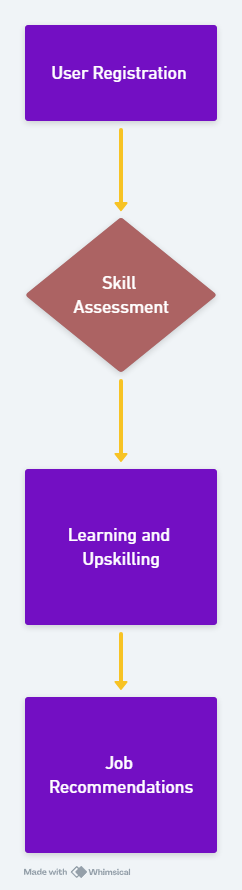
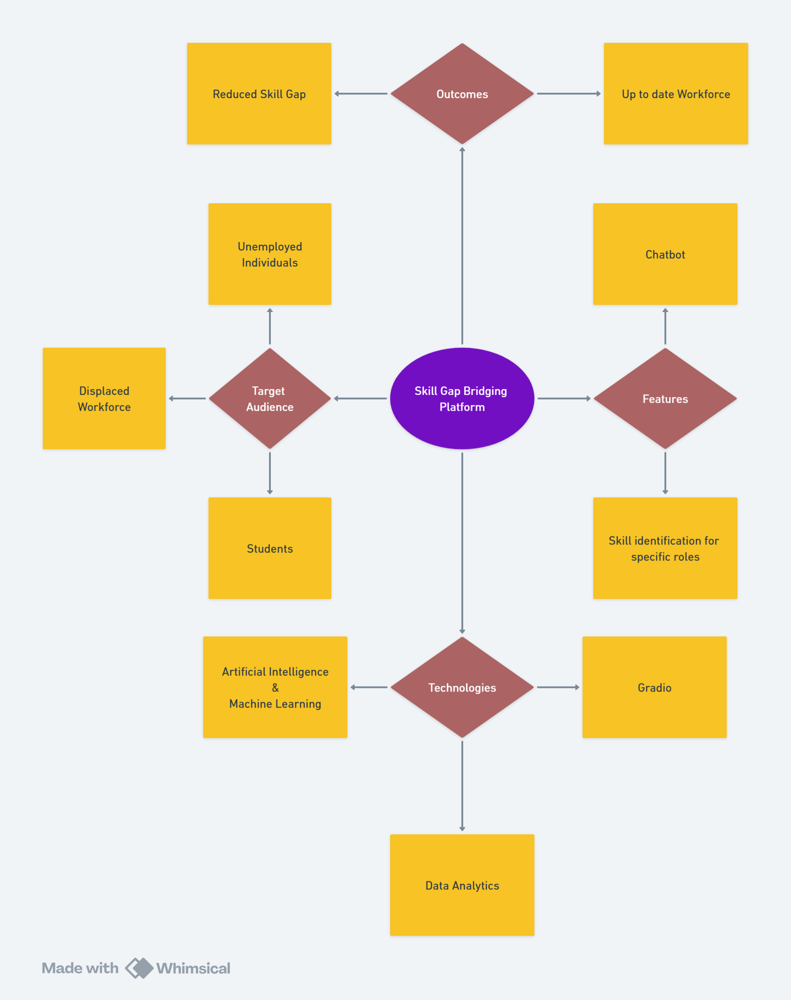

# Skill Gap Bridging Platform

*An AI-powered solution to match skills with industry needs.*

---

## 🔍 Brief Introduction
The big issue that developing countries continue to experience to this date is high unemployment rate. This is widely blamed on large gaps in the skill level of the working population whereby skills possessed by individuals do not match with the demand in the market place. Whereas in early stages of economic development this gap remains relatively small, in constantly developing economies, this gap widens and many people, willing to work, cannot find satisfying employment.To solve this critical problem, we have designed skill gap-bridging platform which could help the future workforce to be equipped with necessary tools and training for it. This platform will help in making sure that young people are not only informed on the new developments in the technology world but also trained in ways that will meet current employment market. As the youth is offered structured, practical and industry related learning opportunities, knowledge and skills that increase their marketability in the labor market, the platform achieves the above objectives.The key motivation for this scheme is to reduce the skill gap and help in enhancing the skill level in a population as a whole. Doing so, the platform assists people in finding better jobs and consequently lessens unemployment and contributes to the economy’s development. Finally, it goes beyond helping the workers or stakeholders but also contributes immensely to the creation of value in the economy through a ready force to meet emerging job market challenges.

## 🛠 Problem Statement
In a rapidly evolving job market, individuals often face challenges in identifying and bridging skill gaps to meet the requirements of their desired job roles. Traditional methods of upskilling lack personalization and fail to align with specific career aspirations, leaving users unsure of the most effective path forward.
The goal is to develop an AI-driven upskilling recommendation system that:Identifies Skill Gaps,Compares a user’s current skill set against the requirements for specific job roles across industries.Provides Personalized Recommendations: Suggests targeted online courses, certifications, or workshops (e.g., Coursera, Udemy) that align with the user's career goals and skill gap analysis.Ensures Relevance: Recommends learning resources tailored to the latest industry trends and employer demands.By addressing this problem, the system aims to empower individuals to enhance their employability, advance in their careers, and adapt to dynamic workplace requirements

## 📊 Workflow Diagram

The workflow begins with dataset preprocessing, followed by model training and evaluation. Finally, it allows real-time skill predictions based on user inputs.

---

## 🧠 Concept Map

The concept revolves around aligning individual learning paths with industry demands while promoting career growth and workforce retention.

---

## ⚙️ Tech Stack
- **Python**: Pandas, scikit-learn
- **Machine Learning**: KNN Classifier with MultiOutputClassifier
- **Version Control**: GitHub for collaboration and version control

---

## 🌟 Novelty
- **Industry-Centric Focus**: Creates individual learning paths aligned with the specific needs of industries and the skills they expect from future employees.
- **Two-Way Alignment**: Matches workers with jobs required in industries, providing dream jobs to workers while creating a skilled workforce for industries.
- **Ongoing Career Growth**: Promotes progressive skills enhancement to meet emerging technologies and career advancements.
- **Workforce Retention**: Focused on improving current employees' performance and increasing retention rates, thereby minimizing costs.

---

## 🚀 Solution
The platform processes job titles, company names, and industries to predict core and company-specific skills. It uses a multi-output KNN classifier trained on a structured dataset to ensure accurate predictions.

---

## 📂 Others
- **Dataset**: The project uses a custom dataset containing job-related data.
- **Future Scope**: Integration with real-time job platforms and personalized recommendations for upskilling.
- **Team**: Developed by **CODEFLUENCERS** at the Chennai Institute of Technology.

---

